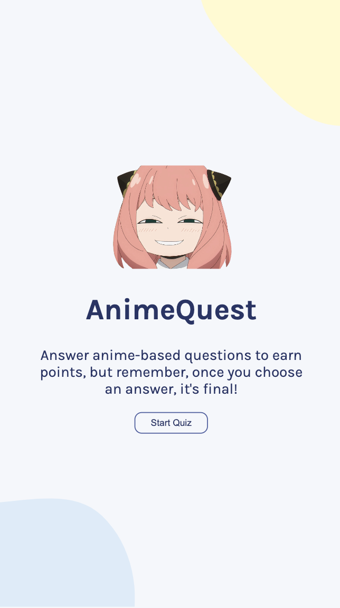
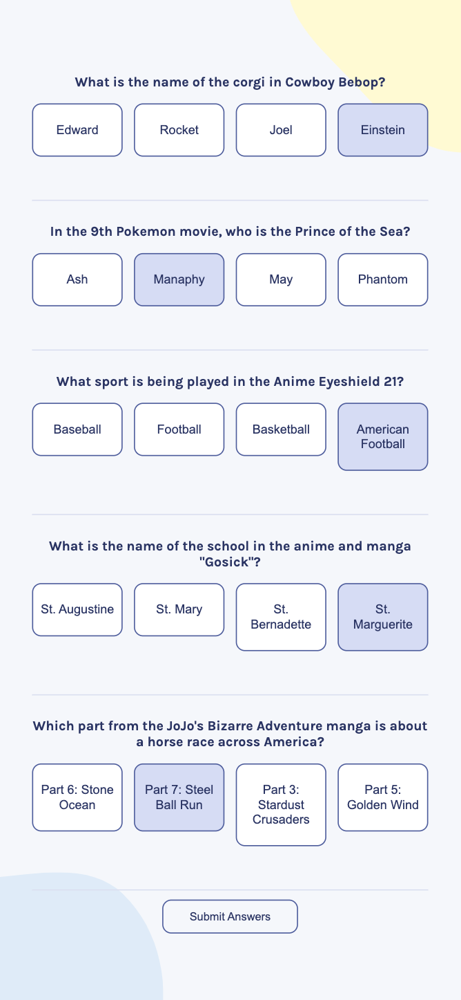
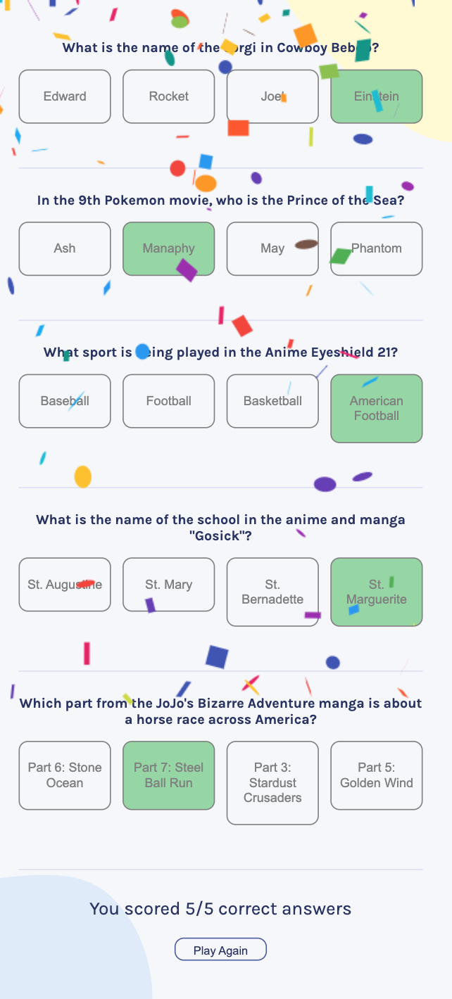

# Anime Quiz Challenge

**Anime Quiz Challenge** is a React-based realtime quiz application that tests your knowledge of anime. Answer anime-based questions to earn points and prove your expertise in the world of anime!

The API of the quiz is from https://opentdb.com/api_config.php

## Table of Contents

- [Anime Quiz Challenge](#anime-quiz-challenge)
  - [Table of Contents](#table-of-contents)
  - [Getting Started](#getting-started)

## Getting Started

To run this application locally on your machine, follow these steps:

1. Clone the repository to your local machine:
   ```bash
   git clone https://github.com/psathyanarayan/Quizzical.git
2. Navigate to the project directory:
   ```bash
   cd Quizzical
3. Install the necessary dependencies:
    ```bash
    npm install
4. Start the development server:
   ```bash
   npm run dev


